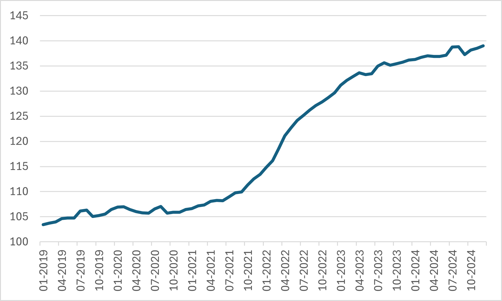
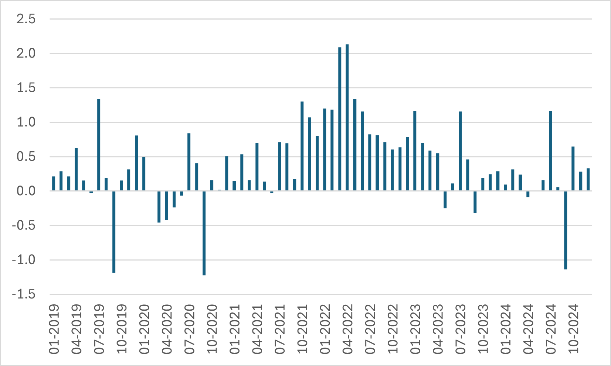
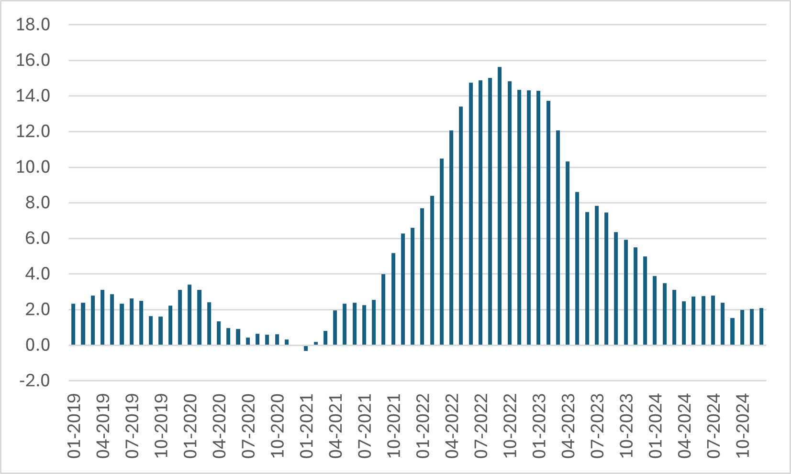
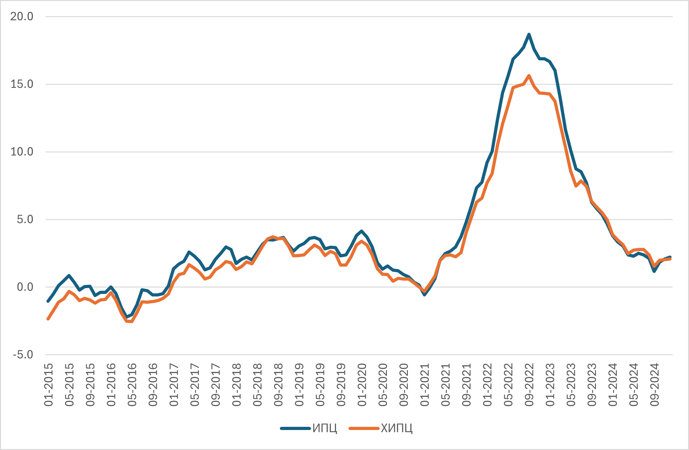

Ценови индекси и инфлация
=========================

## Изчисляване на инфлацията от зададен индекс

```{exercise}
:class: problem

От данните в таблицата по-долу изчислете:
- Инфлация спрямо период 1 (натрупана инфлация)
- Инфлация спрямо предходния период

| Период | ИПЦ   |
|--------|-------|
| 1      | 100.0 |
| 2      | 102.0 |
| 3      | 105.1 |
| 4      | 115.6 |
```

```{dropdown} Решение
В случая натрупаната инфлация спрямо период 1 може да бъде взета директно от индекса, тъй като базата е също период 1. За период 2 имаме:

$$102.0 - 100.0 \quad \rightarrow \quad 2\%$$

Аналогично за период 3 и 4 получаваме $5.1\%$ и $15.6\%$. 

Инафлацията спрямо предходния период е както следва:
- Период 2: $102.0/100.0-1 = 2\%$
- Период 3: $105.1/102.0-1 = 3\%$
- Период 4: $115.6/105.1-1 = 10\%$
```

<br>

```{exercise}
:class: problem
:label: infl1

От данните в таблицата по-долу изчислете:
- Инфлация спрямо период 1 (натрупана инфлация)
- Инфлация спрямо предходния период

| Период | ИПЦ   |
|--------|-------|
| 1      | 230.0 |
| 2      | 232.3 |
| 3      | 227.7 |
| 4      | 239.0 |
```

<br>

```{exercise}
:class: problem
:label: infl2
Попълнете липсващите стойности в таблицата по-долу:

| Период | ИПЦ  | Инфлация, натрупана | Инфлация, спрямо предх. период |
|--------|------|---------------------|--------------------------------|
| 1      | __   | -                   | -                              |
| 2      | 30.8 | __                  | 2.5%                           |
| 3      | 31.8 | 6.1%                | __                             |
```

<br>

```{prf:example} Инфлационни процеси в България, 2018-2024

**ХИПЦ, 2015=100**


**Инфлация според ХИПЦ, предходният месец = 100**


**Инфлация според ХИПЦ, същият месец на предходната година = 100**

```

<br>

```{prf:example} Разлики между ИПЦ и ХИПЦ за България

**Инфлация според ИПЦ и ХИПЦ, същият месец на предходната година = 100**

```

## Конструиране на ценови индекс от зададени компоненти

```{exercise}
:class: problem
Разглеждаме потребителска кошница, съставена от две стоки, хляб и облекло, с тегла съответно 60\% за хляба и 40\% за облеклото. Таблицата по-долу задава цените на стоките за два периода, $ t=1,2 $. Пресметнете индекса на потребителските цени за период 2 спрямо период 1.

| Период | Хляб | Облекло |
|--------|------|---------|
|	1    |   2  |   120   |
|	2    |   4  |   150   |
```

```{dropdown} Решение

Индексът на цената на хляба е $4/2 = 2$.

Индексът на цената на облеклото е $150/120 = 1.25$

Общият индекс е $0.6 \times 2 + 0.4 \times 1.25 = 1.7$ или, след стадартното прескалиране с умножаване по 100, имаме индекс $170$ за период 2 спрямо период 1.

```

<br>

```{exercise}
:class: problem
:label: infl3
Като използвате данните от дадената таблица и тегла от 30% и 70% съответно за стоки 1 и 2, изчислете инфлацията за 2025 г.

| Година | Стока 1 | Стока 2 |
|--------|---------|---------|
| 2024   | 20      | 50      |
| 2025   | 25      | 60      |
```

<br>


```{exercise}
:class: problem
:label: infl4
Като използвате данните от таблицата по-долу и имате предвид, че общият ценови индекс за период 2 при база период 1 е 120, изчислете теглата на стоки 1 и 2 в потребителската кошница.

| Период | Стока 1 | Стока 2 |
|--------|---------|---------|
| 1      | 180     | 320     |
| 2      | 200     | 400     |
```


## Средна инфлация

```{exercise}
:class: problem
:label: infl5
Дадена е следната информация за ИПЦ при фиксирана база по тримесечия за две години:

| Тримесечие | ИПЦ, година 1 | ИПЦ, година 2 |
|------------|---------------|---------------|
| 1          | 110.0         | 118.5         |
| 2          | 112.2         | 120.2         |
| 3          | 115.6         | 122.7         |
| 4          | 116.7         | 123.3         |

- Изчислете натрупаната инфлация между 1-вото тримесечие на година 1 и четвъртото тримесечие на година 2.
- Изчислете индексите за година 2 при база съответното тримесечие на предходната година.
- Изчислете средната инфлация за втората година, като използвате аритметична средна на конструираните индекси при база съответното тримесечие на предходната година.
```

```{dropdown} Решение
Натрупаната инфлация е $123.3/110.0-1 = 12.1\%$

За индексите имаме съответно

$$ 118.5/110.0 = 1.077 $$

$$ 120.2/112.2 = 1.072 $$

$$ 122.7/115.6 = 1.061 $$

$$ 123.3/116.7 = 1.056 $$

На тази основа имаме усреднен индекс

$$ \frac{1.077+1.072+1.061+1.056}{4} = 1.067 ,$$

т.е. средната инфлация е $6.7\%$.
```

<br>


```{exercise}
:class: problem
:label: infl6
Като използвате данните от {ref}`infl5`, изчислете средната инфлация като съотношение на аритметичните средни на индексите от таблицата за първата втората и година.
```

```{dropdown} Решение
Имаме

$$\frac{(118.5+120.2+122.7+123.3)/4}{(110.0+112.2+115.6+116.7)/4}-1 = 6.6\%.$$
```

```{note}
От решението на {ref}`infl6` е ясно, че при тази дефиниция средна инфлация може да се изчисли по-просто, като се използва отношението на сумите на индексите за двете години.
```


```{dropdown} Отговори

{ref}`infl1`:`   За периоди 2,3,4 -- Натрупана инфлация: 1%, -1%, 3.9%; Инфлация t/t-1: 1%, -2%, 5%`

{ref}`infl2`:`   30.0, 2.5%, 3.5%`

{ref}`infl3`:`   21.5%`

{ref}`infl4`:`   36%, 64%`
```