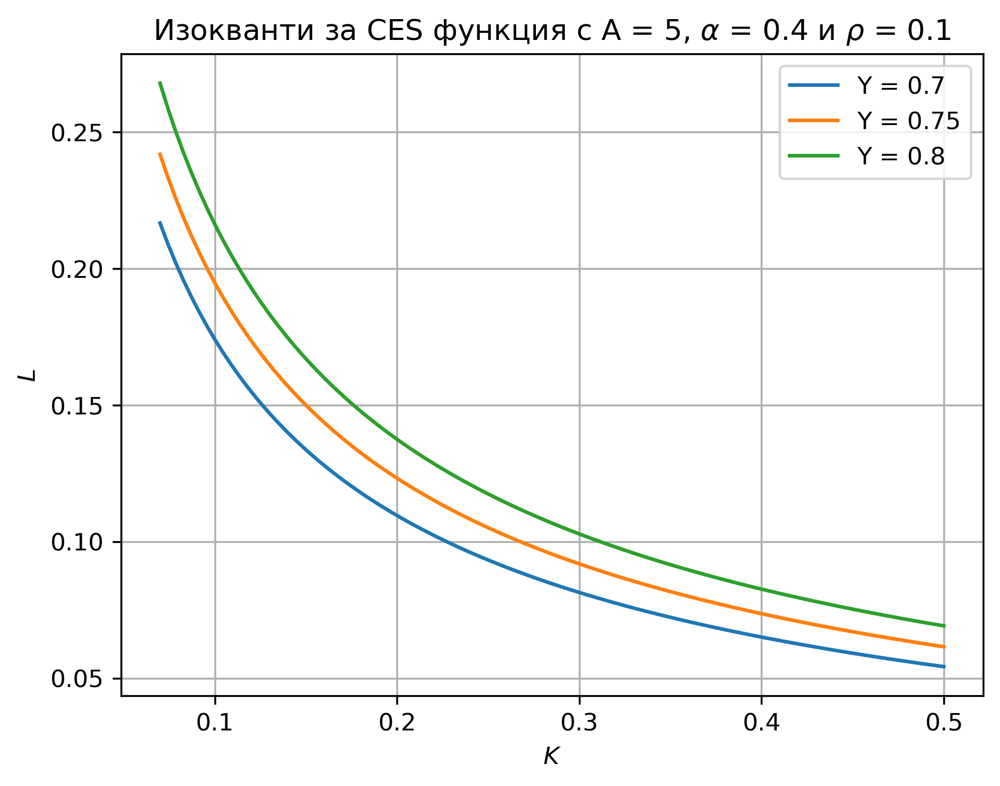
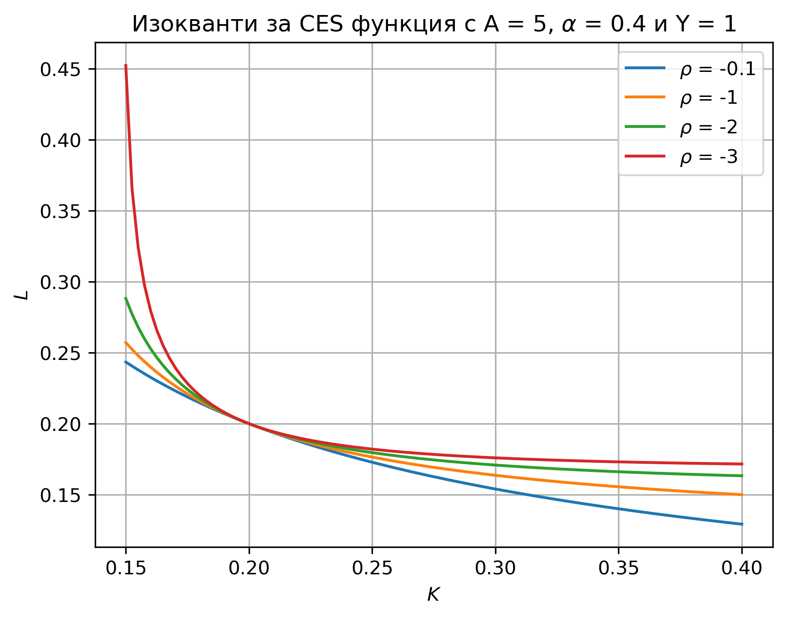

Производствени функции
=======================

## Някои често използвани производствени функции

За всички примери за производствени функции, дадени по-долу, се приема, че производствените фактори са безкрайно делими.

Функция на Коб-Дъглас (Cobb-Douglas):

$$ F(K,L) = A K^\alpha L^{1-\alpha}, \quad \alpha \in (0,1) $$

Функция на Леонтиев:

$$ F(K,L) = \min \left\{ \frac{K}{a}, \frac{L}{b} \right\}, \quad a,b>0 $$

Линейна производствена функция:

$$ F(K,L) = a K + b L, \quad a,b>0 $$

Функция с постоянна еластичност на заместване (CES):

$$ F(K,L) = A \left[ \alpha K^{\rho} + (1-\alpha)L^{\rho} \right]^{\frac{1}{\rho}}, \quad \alpha \in (0,1),~\rho \leq 1,~\rho \neq 0 $$

<br>

```{note}
По-обща форма на CES функцията е 

$$ F(K,L) = A \left[ \alpha K^{\rho} + (1-\alpha)L^{\rho} \right]^{\frac{\nu}{\rho}}, \quad \alpha \in (0,1),~\nu>0,~\rho \leq 1,~\rho \neq 0. $$

Типично за CES функцията се допуска $\nu = 1$ и ние го приемаме за дадено, освен ако изрично не е казано друго.
```

<br>


При това положение от представените функционални форми CES функцията е най-гъвкавата: при $\rho = 1$ имаме вариант на линейна форма, при $\rho \rightarrow 0$ се получава Коб-Дъглас, а при $\rho \rightarrow -\infty$ се приближава функцията на Леонтиев.

## Изокванти (линии на ниво)

Изокванта за ниво на производство $\bar{Y}$ се дефинира като 

$$ \{ (K,L) \vert F(K,L) = \bar{Y} \}$$

**Примери за изокванти**







```{exercise}
:class: problem

Изобразете изоквантите на функцията на Леонтиев за $a=b=1$.
```

## Пределни продукти на производствените фактори

Пределният (маргинален) продукт на фактор $X_i$ за диференцируема производствена функция $F(X_1, \ldots, X_n)$ се дефинира като $\dfrac{\partial F}{\partial X_i}$. Понякога за двуфакторна производствена функция с фактори труд и капитал се използват означенията съответно $MPL$ и $MPK$.

```{exercise}
:class: problem
:label: pf_mpl1

Пресметнете пределните продукти на труда и на капитала за следните производствени функции:
- функция на Коб-Дъглас
- линейна функция
- CES функция
```

<br>

```{exercise}
:class: problem

Проверете дали получените в {ref}`pf_mpl1` пределни продукти са положителни.
```

<br>

```{note}

Понякога пределните продукти за функцията на Коб-Дъглас се записват във вида

$$ MPL = (1-\alpha)\frac{Y}{L}, \quad  MPK = \alpha\frac{Y}{K} $$
```

<br>

```{exercise}
:class: problem

Проверете, че формата на пределните продукти, дадена в предходната забележка, може да бъде получена от стандартната дефиниция.
```

<br>

```{exercise}
:class: problem

Проверете дали за следните производствени функции е в сила свойството намаляваща пределна производителност (намаляваща възвръщаемост):
- функция на Коб-Дъглас
- линейна функция
- CES функция
```

```{dropdown} Решение
Вторите производни съответно по $L$ и $K$ са както следва:

**Коб-Дъглас**

$$ \alpha (\alpha-1) A K^\alpha L^{-\alpha-1} < 0, \quad \alpha (\alpha-1) A K^{\alpha-2} L^{1-\alpha} < 0 $$

**Линейна**

$$0, \quad 0$$

**CES**

$$ (1-\alpha)(\rho-1)\alpha A K^{\rho} L^{\rho-2} [\alpha K^\rho + (1-\alpha)L^{\rho}]^{\frac{1-2\rho}{\rho}} < 0 $$

$$ (1-\alpha)(\rho-1)\alpha A K^{\rho-2} L^{\rho} [\alpha K^\rho + (1-\alpha)L^{\rho}]^{\frac{1-2\rho}{\rho}} < 0 $$

```


## Възвръщаемост по отношение на мащаба

```{exercise}
:class: problem
:label: pf_crs

Кои от следните производствени функции се характеризират с постоянна възвръщаемост по отношение на мащаба?
- функция на Коб-Дъглас
- линейна функция
- CES функция
```


## Условия на Инада

```{exercise}
:class: problem

Покажете, че за функцията на Коб-Дъглас са изпълнени условията на Инада.
```


## Формула на Ойлер

$$ F(X_1,\ldots,X_n) = \sum_{i=1}^{n}F_{X_i} X_i $$

```{exercise}
:class: problem

За двуфакторна неокласическа производствена функция с труд $ L $ и капитал $ K $ е известно, че при стойност на производствения фактор $ L=10 $, имаме пределен продукт на труда със стойност $ \frac{2}{5} $ и пределен продукт на капитала със стойност $ \frac{3}{5} $. Ако обемът на производството е равен на 13, пресметнете стойността на капитала.
```

```{dropdown} Решение
Използваме формулата на Ойлер:

$$Y = F(K,L) = F_K K + F_L L \Longrightarrow 13 = \dfrac{3}{5} K + \dfrac{2}{5} 10  \Longrightarrow K=15. $$
```

<br>

```{exercise}
:class: problem
:label: pf_euler1

За двуфакторна неокласическа производствена функция с труд $ L $ и капитал $ K $ е известно, че при стойности на производствените фактори 
$ L=30 $ и $ K=50 $ имаме пределен продукт на труда със стойност $ 0.5 $. Ако обемът на производството е равен на 40, пресметнете пределния продукт на капитала.
```

<br>

```{exercise}
:class: problem
:label: pf_euler2

За двуфакторна неокласическа производствена функция с труд $ L $ и капитал $ K $ е известно, че при стойности на производствените фактори 
$ L=30 $ и $ K=50 $ имаме пределен продукт на труда (т.е. частна производна по фактора труд) със стойност $ 0.6 $. Ако обемът на производството е равен на 38, пресметнете пределния продукт на капитала.
```


<br>

```{dropdown} Отговори

{ref}`pf_mpl1`: 
- $MPL = (1-\alpha)A K^\alpha L^{-\alpha}, \quad MPK = \alpha A K^{\alpha-1} L^{1-\alpha}$
- $MPL = b, \quad MPK = a$
- $MPL =  (1-\alpha)A L^{\rho-1} [\alpha K^\rho + (1-\alpha)L^{\rho}]^{\frac{1-\rho}{\rho}}$, 
  $MPK =  \alpha A K^{\rho-1} [\alpha K^\rho + (1-\alpha)L^{\rho}]^{\frac{1-\rho}{\rho}}$

{ref}`pf_crs`:`   И трите.`

{ref}`pf_euler1`:`   0.5`

{ref}`pf_euler2`:`   0.4`
```